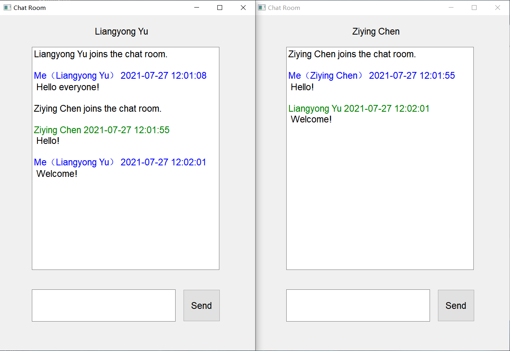

# Chat Room

## 1. Introduction

This is a simple GUI chat room program, where several 
clients can chat with each other. It is written by Python and PyQt.
The communication protocol is TCP/IP. 


## 2. Usage

### 2.1 Directly run the exe program(Only for Windows)

For the server: click `server.exe` in the `dist` directory.

For the client: click `main.exe` in the `dist` directory.

Note that the server and the client need to be in the same computer.
If you want to run server and client in the different computer, you 
need to change the python script and recompile it. 
### 2.2 run the python script

I use python 3.7.6 and PyQt 5.15.0 to write this code. Before running 
this code, make sure that PyQt5 is correctly installed. 

For the server:

```
python server.py
```

You can define port in `server.py`. The default port is `8000`.


For the client:

```
python main.py
```

You can change the server IP and port in `constant.py`. Note that
if the server and clients are on the different computers, change IP address in the file
`constant.py` from `127.0.0.1` to the correct IP address of the server.

